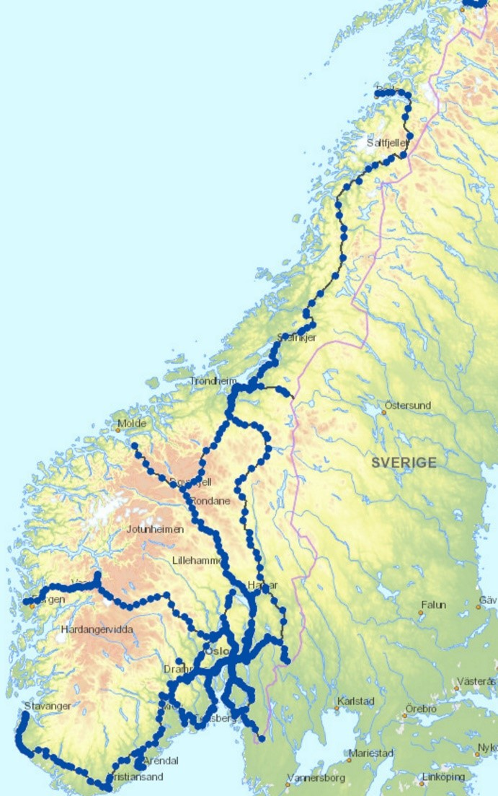
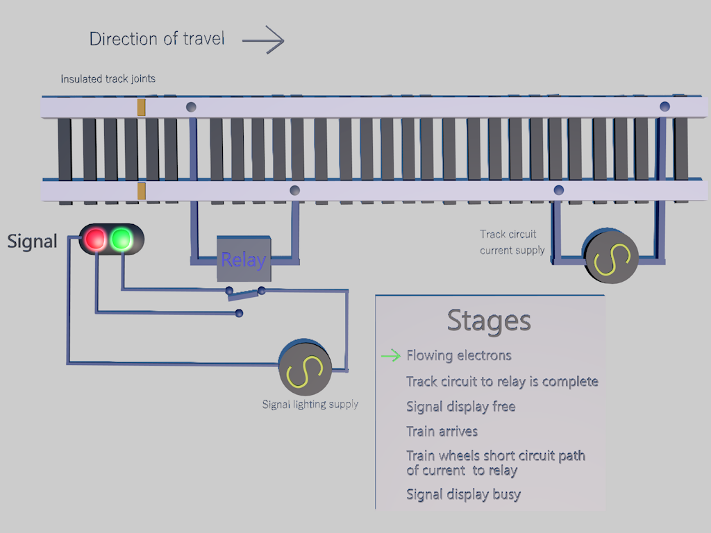
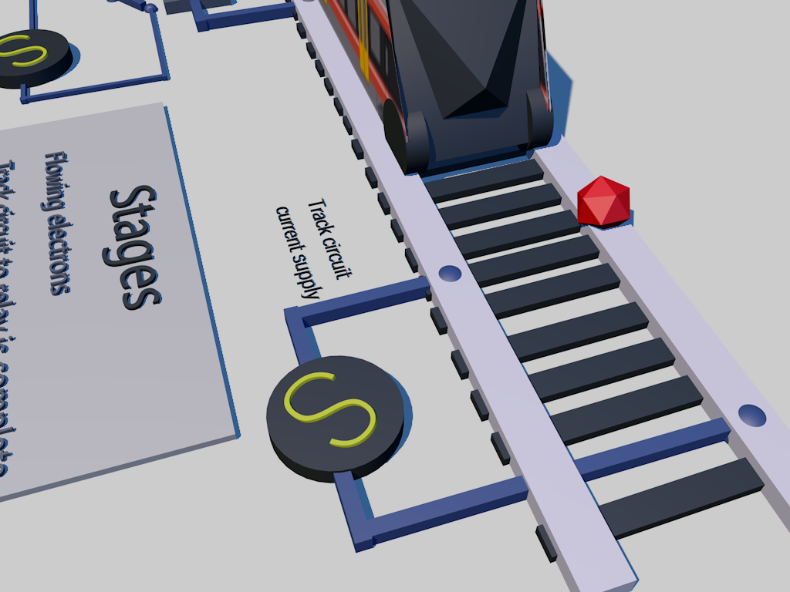
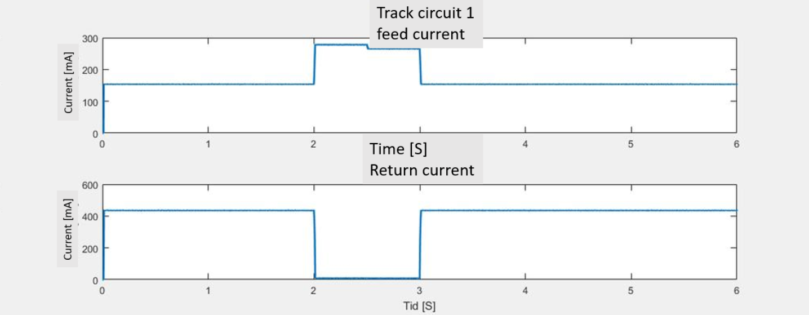
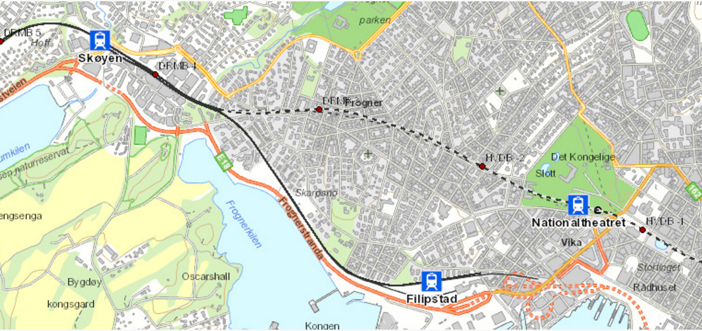
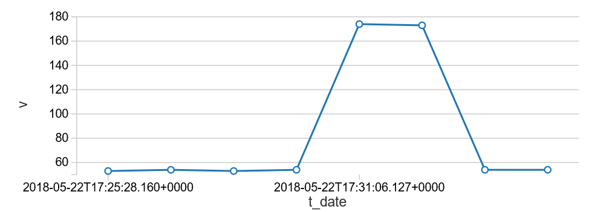
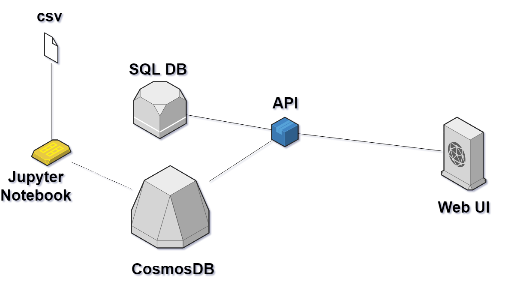
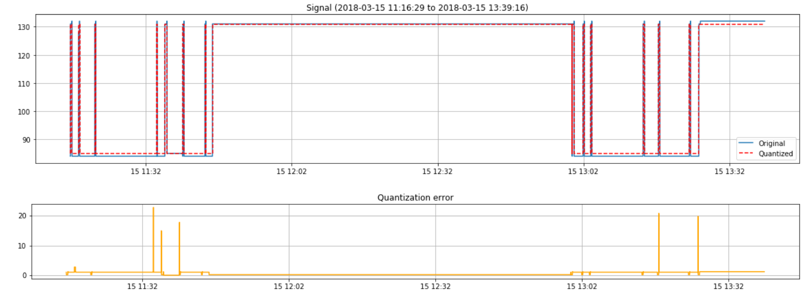
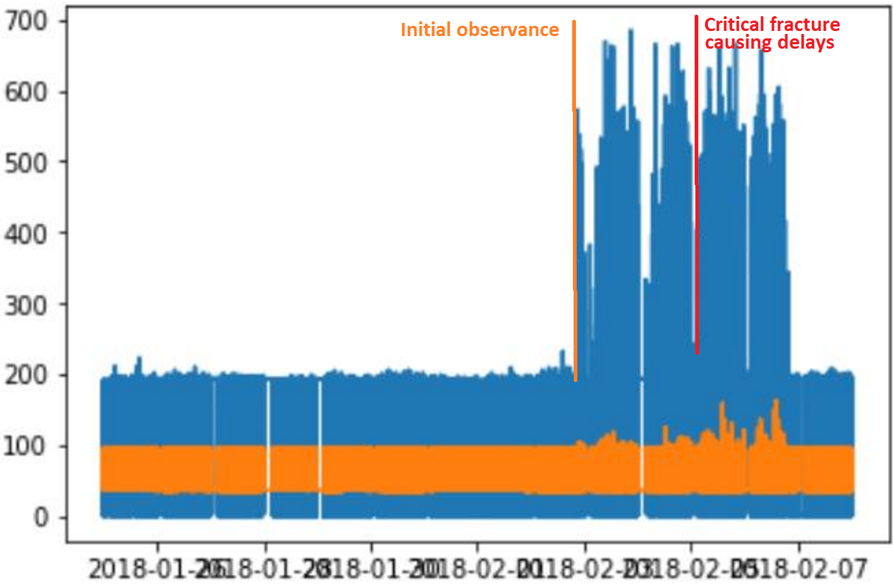

# Track circuit condition/failure analytics

### Authors ###
Version  | Date | Author(s) | Comments
---------| ---- | --------- | --------
1.0  | 02/07/2018 | [Anders Gill](https://twitter.com/TheRealShadyman), [Simon Jäger](https://twitter.com/simonjaegr)  | Initial

## Introduction

This project is a continuation of the engagement started a year back looking into the point machines in the Norwegian railway infrastructure. You can read the former case study here: https://github.com/readyforchaos/BaneNOR-Technical-Case-Study-From-reactive-to-proactive-maintenance-Reduce-railway-delays

A healthy and functional train track circuit is probably the second most important object after the train itself when it comes to the scope of a rail system. A fully-fledged rail system can also tend to become extremely complex and fascinating in regards to all its details. Keeping the track circuits healthy can therefore become a challenge, and failures often occurs in many shapes and forms.

Knowing that the track circuits in Norway tend to break for various reasons, the special team from Microsoft by the name of Commercial Software Engineering (CSE), set out to take on this challenge together with Bane Nor during a 5-day-hackfest.

This case study goes through the process of how we set out to approach this problem of keeping the railway system operational in the sense of applying statistics and machine learning techniques.

**Keywords:** Track circuit, Rail system, Train track analytics, Machine Learning, data labeling.



## Participants

Core  | Company | Role 
---------| ---- | --------- |
Kosuke Fujimoto   | Microsoft CSE Japan | Software Engineer
Justin Bronder   | Microsoft California/US CSE | Software Engineer
Simon Jäger   | Microsoft CSE Nordics Sweden | Software Engineer
Alex Hocking   | Microsoft CSE UK | Software Engineer
Ville Rantala   | Microsoft CSE Nordics Finland | Software Engineer
Anders Gill   | Microsoft CSE Nordics Norway | Software Engineer

Support  | Company | Role 
---------| ---- | --------- |
Patrik Larsson   | BearingPoint  | Applied ML
Vebjørn Axelsen   | BearingPoint  | Applied ML
David Giard    | Microsoft Chicago/US  | Software Engineer
Asu Deniz   | Microsoft Norway  | Data & AI advisor
Hanne Wulff   | Microsoft CSE Nordics Norway  | Program Manager
Warrell Harries   | Voestalpine  | Application Development Manager

Local  | Company | Role 
---------| ---- | --------- |
Adis Delalic   | Bane NOR  | IT Architect
Jørgen Torgerse   | Bane NOR  | Point Machine Condition Monitoring
Dag Mattis Pettersen   | Bane NOR  | Track Circuits Condition Monitoring
Kristine Tveit   | Bane NOR  | Analysis Condition Monitoring
Johanne Norstein Klungre   | Bane NOR  | Engineer Applied Mathematics
Aslak Wøllo Flaate   | Bane NOR  | Economist
Anna Gjerstad   | Bane NOR  | Project Manager Smart Maintenance

## Track circuit

A track circuit is a vital piece of a larger puzzle encapsulating the whole infrastructure of a successful railway architecture. Railway signaling components are also an important piece in this puzzle, and both track circuits and signaling systems goes together to form a successful rail signaling system. 

Track circuits are part of the physical pieces that makes up the actual metal rods that the train wheels rides on. Without the tracks, a train would not be able to get from point A to point B. There are essentially two main pieces of a track, the left hand running rail, and the right hand running rail. Multiple tracks are connected together through joints, sometimes insulated joints so that the electricity flowing does not pass through from one block to another. The track circuit is an electrical device installed on the track to provide an indication of train presence on a section of a track. The system is often referred to as “fail safe” system. Below is an illustration of how the signaling system is laid out:



**Block unoccupied**

A low voltage from a battery is applied to one of the running rails in the block and returned via the other.  A relay at the entrance to the section detects the voltage and energizes to connect a separate supply to the green lamp of the signal.

**Block occupied**

When a train enters the block (right), the leading wheelset short circuits the current, which causes the relay to de-energize and drop the contact so that the signal lamp supply circuit now activates the red signal lamp. (PRC Rail Consulting Ltd, 2018)

<span style="color:red">**Click on the thumbnail below to see an animation of how the current flows:**</span>

[](https://www.youtube.com/watch?v=ifT_EBRe4WI)

## Problem statement

Bane nor wants to improve their abilities within condition-based maintenance for track circuits, meaning that they want to make better decisions as to which track circuits they should perform maintenance on when (timing), and preferably how (what is an effective measure / what is the root cause of the unhealthy condition). By leveraging historical data on track circuit conditions (mainly current sensor data) and faults, the aim was to find patterns in e.g. degradation behavior that can be exploited to predict when a component is nearing a significant fault condition (or failure situation). With sufficiently precise predictive insight into these matters, Bane nor should be able to be more effective in the planning and the execution of maintenance on their day-to-day operations.

## Data availability

Data from four domains are available for analysis:
-   sensor data on the current flowing in the track circuit
-   track circuit attributes and network (neighbor) structure (master data)
-   maintenance work orders (maintenance operations data)
-   manually labeled fault/failure data (condition monitoring registers)

### Current sensor data

The main data source will be the return current for the track circuit, measuring the current flowing from the receiver to the transmitter. This data existed as sensor measurements on the current flowing through the signaling relay (receiver side), given in mA. The measurement frequency was originally 1 hz, but the measurements seen in the data are often less frequent due to a dead-band technique for reducing data volumes: succeeding sensor measurements that are the equal (or, more precisely, where the absolute difference is below a low threshold) are filtered out.

The current sensor data contains info about:
-   Track circuit
    -   Rail station (location)
    -   Underlying technical room
    -   Track circuit ID
-   Measurement timestamp (UNIX timestamp with milliseconds)
-   Measurement value (mA)

In addition to the return current, similar data on the same above data fields was also available for the feed current. The feed current is the current that flows out of the transmitter.



The sensor data available was for a timespan of approximately one year, ending March 2018. The data for this engagement covers two rail stations: Nationaltheatret and Skøyen.



### Track circuit master data

The track circuit network was made available in a graph database format, for each track circuit (section) describing which other track circuits (sections) that is its neighbors. In addition to this graph data, the following attributes were available for the track circuits themselves:
-   Length (m)

### Maintenance work orders

A list of historical maintenance work orders was provided, that describes specific situations (events) when maintenance personnel has been sent to a given track circuit to perform maintenance, e.g. to improve on a detected non-healthy condition. The following attributes were some of the available attributes:
-   Start date
-   Close date
-   Type of work order (describes which division of Bane NOR that is sent out)
-   ID of track circuit

Maintenance work orders are not sufficiently precise for identifying and labeling fault/failure situations, as the start and close dates often don’t coincide with the actual fault/failure period. For instance, a fault may have been present for some time before a work order is initiated, and sometimes the fault persists also after the work order is closed (e.g. when the work performed did not fix the fault). Some care was therefore taken when using work order data for labeling (e.g. as basis for producing a supervised target variable).

### Manually labeled fault/failure data

To pursue the goal of approaching the problem with a supervised mindset, some work has been conducted of manually labeling the time and track circuit to a specific condition. This work was based on the manual work orders to find events and then completed by visually inspecting the data around this event to label it. The data was labeled using 9 different labels, where one label was designated as a healthy condition. The following attributes were available:

-   Sensor ID (or possible track circuit ID)
-   Timestamp fault start
-   Timestamp fault end
-   Label

Due to the nature of manually labeling data, a very small subset was labeled successfully at the start of the Hackfest. The labels used were based on the expertise and domain knowledge of employees working at Bane Nor, but the labels are not automatically data-derived so there could possible exist pattern in the data that were not covered by these 9 labels.

Conceptually, the current sensor data time series could be divided into two main stages: train present (train passage) and train absent. The length of a train passage stage is dependent on the length and speed of the train passing. The length of a train absence stage is the time between two train passages.

We identified intervals in the time series for each track circuit as being either a
-   train passage, or
-   train absence. 

Under normal conditions, train passage has a quite regular square shape in the current curve, whereas train absence is generally uniform.




*Sensor-readings over a time-period containing one train passage on a healthy track circuit. The measurements for the return current (RC) is displayed to the left and the measurements for the feed current (FC) is displayed to the right. Please note that this is just a visualization and that the underlying time-series for these graphs only contains values when the current have changed from previous measurements.*

We expect that degradation or other fault condition patterns for different fault types; will present themselves differently when the train is passing and when it is absent. It was therefore unclear which of these two stages provide the best signal for predicting faults and failures. There was also some uncertainty surrounding which fault types patterns that can be visible when a train was passing and when it was absent.

Regardless of which of these stages one chooses to focus on (if not both in combination), we did believe that when translating the time series data into a flat data set for analysis, structuring this process around the train passage and train absence stages could be a sensible approach (instead of e.g. doing windows with a fixed length). Examples of data set structures emerging from this could be:
-   Passage based: One row per passage, with features from that passage time series curve, as well as features from (windows of) preceding and succeeding absence period time series
    -   Focus is on the passage time series curve, and we supplemented with times series data from absence periods adjacent to the train passage.
-   Absence time resolution based: One row per <time resolution unit> in absence periods, with features from the absence period within the time window
    -   Focus was on the absence time series curve, and we disregard the passage data completely (or, alternately, include some info on the preceding/succeeding passages)

For both approaches, features can be built to describe how the shape of the time series (sensor data) has evolved over the last X/Y/Z passages or time resolution units.

Before we eventually could try to dig into supervised learning methods to develop predictive models, we knew that the data was currently limited in both volume, completeness and precision (as mentioned above).
To remedy this, we thought of some approaches that could be worthwhile investigating:

-   **Unsupervised:** Training a clustering model on the flattened time series curves for passages or absence periods for “all” available sensor data, and then matching these onto known fault/failure conditions, by inspection or other method. If there are sufficiently distinct patterns in the time series alone that match up with the different fault/failure types, we could expect that a clustering approach would be valuable.
-   **Supervised:** Training a classifier based on the data (combined track circuits and time periods) where we have sufficient quality on the fault/failure labels, and then scoring the rest of the (unlabeled) data using this model to classify into healthy or fault/failure types. This method was prone to be a bit risky, as we didn’t have any clear way to evaluate the correctness of this classification (aside from our labeled data, which was already very limited in volume), and therefore introduces significant uncertainty into the succeeding development of a fault/failure predictive model.

## Going into the hack

The entire railway system we set out to work on, generally runs pretty well. This means that there are not many failures. In a perfect machine learning world, we would hope for having many failures which we can learn from, but on the flipside, having a firmly running system is more important. 

Going into the hack, we had 40 failures registered that were known and labeled as one or another type of failure. Because of this, certain approaches of using labeled data for deep learning then gets thrown off the board. In order to rectify this, we did build a tool for users to label data when different kind of anomalies are detected. Eventually when there is enough data, Bane Nor can start to use deep learning approaches to detect anomalies by having enough labeled failures from this time-series labeling tool.

The second topic we started to discuss, was the dimensionality of the data. Since there is not 200+ sensors feeding us data of e.g. RPM of an engine, oil temperature, friction etc., having a lower dimensionality of the data yields us being able to use simpler techniques to hopefully solve the problem. The data we had to work with in this case, was a track circuit that was being measured and sampled over time, that gave us a milliampere level for both a feed current and a return current.

We discovered that every track segment, based on its physical length or based on the amount of time the circuits had been placed on a particular segment, had different profiles. The measures of current varied in the low levels, and the high levels for all the segments. This means that doing a global thresholding approach would not work because of the variation, e.g. if a track circuit is noisier but actually acts normal because of the aforementioned nature. Based on that information, we had to build systems that used the signatures of each one of the track segments as its own “normal” and detect the anomalies on a per-track-segment level. This was the second tool we created, a machine failure labeling engine.

## Goal

There were two main goals for this engagement:

1. **Detection**

Can we do some data statistical analysis to do the detection of the existing failures that we know about?
 
We informed ourselves on a full list of the work orders provided (an incident registered after the failure telling an engineer to look at the particular track circuit) and started to dig into the different characteristics of the signals for all failure types. An example of this could be sparking, which is caused by metal shavings which in return will yield fluxuation in the amperage along the track signal.

2.	**Prediction**
Can we do some prediction of those signal characteristics before they turn into failures and result in work orders based on the signaling patterns?

3.	**Labeling**
Can we create a tool that allows humans to label the raw data stream with failures in an easy manner while having a machine with an algorithm doing the same based on its own intuitions?

## Solution Overview

### Current solution

There was in total 26 work orders gathered from the asset management system as faults. The work orders contain information about the faults that the track circuits have had. This served as the guideline when Bane Nor were to label the data. These work orders contained information like “Time when the fault occurred”, “Troubleshooting started”, “Discovered by”, “Delays”, “Consequence”, “Comment form field personnel” etc.
There was in total 44 labeled observations based on the work orders. The list contained columns of:
-   Sensor ID: The dataset name of the sensor(s) that revealed the fault. One work order ID can have more than one sensor ID. The reason for this is that neighboring track circuits might reveal the fault as well.
-   Timestamp fault end: The timestamp when the fault occurred.
-   Standing condition: The condition is always in “present” in the dataset
-   Work order ID: Work order ID from the work orders in the asset management system.
-   Tag: Label for this condition. One work order ID can have more than one label.
The 10 tags that were identified from the job conducted above, were the following (used as the foundation of all the work during the Hackfest):

Label  | Label name | Description | Frequency of labels
---------| ---- | --------- | --------
1  | Constant disturbance | The signal in the circuit should be square wave, and feed is inverse of return, but in this case we don't have square wave -- noise superimposed on square wave | have at least 1
2  | Train disturbances | Noise on signal only when there is a train there, and the no train is a clean signal | have at least 2
3  | Safety failure | Too high a level of current when there is no train | no labels yet
4  | Track flick | A short drop that looks like a train is there, but the duration is shorter than expected, and with jitter | Very common
5  | Constant occupation | A long drop that stays there longer than a train would normally be there | 3 or 4 examples
6  | Developing occupation | Gradual degradation of signal even when no train is present | no labels yet
7  | Loss of current | Drops to zero or near zero | no labels yet
8  | Rail fracture | when rail breaks, generates a constant occupation -- likely examples are ground rail breaks | have labeled examples
9  | Good track circuit | non-stopping errors on the signal. Needs more work to identify, may have multiple modes | no labels yet
10  | Neighbour | Least accurate labels, if you have known fault in something, may affect nearby track segments | have labeled examples

Throughout the Hackfest, we created the “frequency of labels” column in the table above where we tried to identify the different labels from the machine labeling approach (as you can see, we did manage to identify a few of them through the machine labeling approach).

### Approach

Several aspects of the problem informed our approach. The first is the sparsity of data. There are several classifications of problems, but few examples of failures. [Note: this is a good thing. That means that the rail segments aren't breaking down frequently.]

The second is the nature of the signal data. The data is not high dimensional. It is two scalar values: a forward current measurement and a return current measurement, over time. The sampling rate is not particularly high. This means that we can effectively apply simpler techniques than are needed for complex, higher dimensional data.

However, those techniques can't be simple thresholding across all track signals. The high and low current levels vary per track: they depend upon the length of track, the degradation of the electrical circuitry, and environmental factors. In addition, new track is expected to be laid, and new sensors will come online.

So, we decided to use each forward and return current as its own metric of normalcy. We use a technique called k-means clustering to separate current samples into three clusters for the forward current (zero, low, and high), and two for the return current (zero and high).

This approach allows each track segment to have its own mean, acceptable standard deviation (noise) across a step in the square wave signal, slope of the step, and thresholding for overly high or low values.
However, we also felt it to be of use to build out parts that will allow for human labeling of data in the future. The architecture we're building is generalizable to anomaly detection for other types of signals, and we may have a chance to use supervised learning approaches to do anomaly detection on those.

As such our visualization tooling has capabilities to human-label segments of a time series and to visualize machine labeled segments as well.

### Technical delivery

We generated CSV files for the hack week to be ingested by python in Jupyter Notebooks. We used matplotlib and seaborn for visualization within the notebooks and used pandas for the data frame manipulation and tabular data visualization, with NumPy/SciPy/Scikit-learn for the data analysis.

The notebooks are for exploration and validation of the approach and were invaluable in finding problems or bugs in both our data and our approach. We found that we needed to cluster differently for forward and return currents, and we need to up-sample the data to a constant sampling frequency to generate uniform distributions for the statistical analysis.



Eventually the data ingestion part will be a live (or semi-live) stream of data from the track sensors on Azure. The code doing statistical analysis will run through python and will continuously label the data as it flows through.

#### Human Labeling Approach

Going into the hackfest, Microsoft initially made a game plan of approaching the problem with a supervised machine learning mindset based on Bane Nor’s request of not configuring a threshold-based system. Having discovered in the beginning of the hackfest that there simply was not enough labeled data to follow that approach, a quick turnaround had to be made. The scope narrowed down to include the ability to label the data for it to be functionally prepared for the machine learning models, essentially laying the building blocks for future analysis. Two desired abilities were focused on: 
-   The ability to label the data through a visual tool from a human perspective including:
    -   The ability to drill down on failures on all track circuits
    -   The ability to slice a data extraction between a range of two dates
    -   Add new type of failures
    -   Add flags for early warnings
    -   View and visualize already registered faults on track circuits regardless of origin
    -   Ability to search in table and verify faults labeled by a machine
    -   Toggle between raw track circuit current data and stepped visualization data
    -   Select the traceability of a failure that is to be tagged
    -   Explain the reasoning behind a tag
-   The ability to get machine labeled data from an underlying algorithm [next section]
Two desired overall outcomes for functionality was focused on:
-   The ability to verify and override the machine labeled data
-	The ability to visualize the data including the anomalies


#### Machine Labeling Approach

To process all of the data much faster, we leveraged a machine labeling approach. This helped us go through the entire data set, and flag interesting sections. These sections could then be provided as potential anomalies for Bane NOR to further investigate. 

> Full paper on the method used is available here: [https://github.com/simonjaeger/ml-papers/blob/master/signal_sequence_anomaly.md](https://github.com/simonjaeger/ml-papers/blob/master/signal_sequence_anomaly.md)

##### Upsample

To produce accurate statistical measures and clustering, use continuous signal data. 

Should there be missing data points, put in place a strategy to fill in the gaps. For instance, fill with zeros or the mean of the measured value. This depends on the nature of the signal data and pinpoints why domain expertise is crucial. 

The final demand applies to downsampled signal data. Apply a strategy that takes this into account. Many statistical metrics need a uniform distribution of samples, for accurate computations.

To address the demands, upsample the signal data. The process uses the S/H (sample-and-hold) technique. The technique captures the measured value at a certain point and holds onto it. There are different strategies for when to release the value and resample. After a specific amount of time (e.g. considerable change in the measured value).

Choose the strategy for upsampling the signal data in collaboration with domain experts. 

For new systems, store signal data at full resolution in cold storage. Upsampling large data sets can be compute intensive. To unblock such a scenario, split the concern per device or any other logical unit.

This step is not required if the samples in the signal data already have a uniform distribution. 

##### Code

To upsample the signal data, consider the first and second row of signal data. Extend the signal data between the first timestamp and the second timestamp. Use the measured value from the first row and create new rows. 

Let the resolution of the extended data be consistent. To create a uniform distribution of samples. 

```py
def upsample_sh(df, timestamp_column, value_column, resolution):
    """
    Upsample values from a data frame with the sample-and-hold technique and a 
    given resolution.
    
    :param df: the data frame
    :param timestamps_column: the name of the column with the timestamps
    :param values_column: the name of the column with the values
    :param resolution: the time resolution to upsample with
    :type df: pd.DataFrame
    :type timestamps_column: str
    :type values_column: str
    :type resolution: datetime.timedelta
    :returns: upsampled data frame
    :rtype: pd.DataFrame
    """
    
    # Find indices for column names, as we are using itertuples
    # for faster iteration.
    timestamp_index = np.argwhere(df.columns == timestamp_column)[0][0] + 1
    value_index = np.argwhere(df.columns == value_column)[0][0] + 1

    result = []
    previous_row = None

    # Show progress, as this is a potentially long-running process.
    with tqdm(total=len(df), ascii=True, desc='Upsampling') as pbar:
        for row in df.itertuples():
            # Skip first row.
            if previous_row is None:
                previous_row = row
                pbar.update()
                continue

            # Extend range between rows with value.
            timestamps = np.arange(previous_row[timestamp_index], row[timestamp_index], resolution)
            values = np.zeros(len(timestamps)) + previous_row[value_index]

            result.extend(np.array([timestamps, values]).T.tolist())

            # Set previous row, so that we can compare
            # with it.
            previous_row = row
            pbar.update()
            
    # Create data frame.
    return pd.DataFrame(result, columns=[timestamp_column, value_column])
```

This assumes that the signal data arrives in a reliable time manner. If not, pre-sort the data. These are a few useful tools to prepare the signal data for upsampling.

```py
# Parse timestamps.
df['Timestamp'] = pd.to_datetime(df['Timestamp']) 

# Round timestamps.
df['Timestamp'] = df['Timestamp'].dt.round('s')

# Sort timestamps.
df.sort_values('Timestamp', inplace=True)
```

##### Cluster

To categorize the signal data, perform a one-dimensional clustering. This helps to compute the labels and reason about sequences in the signal data. 

With computed clusters, categorize the data according to its signature. 

This is useful, should the signal data originate from different units. For instance, if a unit has an abnormal measurable high or low (in electronics). Account for the individual signature by applying the clustering per unit. 

Before clustering, decide on the labels for the computed sequences (e.g. zero, low, high). The labels should represent meaningful states of the signal data. Use histograms of the signal data and domain expertise to find clusters.

The method associates the labels with the clusters (centroids). 


*Figure 1: Histogram of signal data (measured values). Left figure shows satisfactory separation, suitable for 2 clusters. Right figure shows tolerable separation, suitable for 3 clusters.*

If the signal data does not cluster well, identify a different strategy to separate it.

##### Code

The method applies a k-means clustering algorithm on the signal data. K-means clustering is fast (varying with implementations) and works well for large data sets. Substitute the k-means algorithm with a different algorithm, should it be more suitable. 

After clustering, resolve the labels. The process assumes ordered labels (e.g. low and high). This means that the first label (low) is numerically lower than the second label (high). Use the cluster centroids to determine the order of labels.

```py
def cluster1d(df, value_column, label_column, ordered_labels):
    """
    Cluster and label values from a data frame.
    
    :param df: the data frame
    :param value_column: the name of the column with the values
    :param value_column: the name of the column with the labels to be created
    :param ordered_labels: the ordered list of labels to cluster the values with
    :type df: pd.DataFrame
    :type value_column: str
    :type label_column: str
    :type ordered_labels: list
    :returns: labeled data frame
    :rtype: pd.DataFrame
    """
    
    # Create estimator.
    estimator = KMeans(n_clusters=len(ordered_labels))
    
    # Reshapre data and fit estimator.
    estimator.fit(df[value_column].values.reshape(-1, 1))
    
    # Create labels.
    cluster_centers = estimator.cluster_centers_.tolist()
    sorted_cluster_centers = cluster_centers.copy()
    sorted_cluster_centers.sort() 
    
    labels = []
    
    # Show progress, as this is a potentially long-running process.
    with tqdm(total=len(df[value_column]), ascii=True, desc='Clustering') as pbar:
        # Map correct label to the correct cluster centroid. This
        # assumes that cluster centroids are uniquely identifiable.
        for label in estimator.labels_:
            #[sorted_names[sorted_thresholds.index(thresholds[i])] for i in range(len(thresholds))]
            labels.append(ordered_labels[sorted_cluster_centers.index(cluster_centers[label])])
            pbar.update()
            
    # Create data frame and cluster centers.
    df = df.copy()
    df[label_column] = labels
    return df, np.array(sorted_cluster_centers)[:,0]
```

##### Quantize

To reason about sections of the signal data, compute sequences (i.e. quantization). Use the sequences to explore the statistical measures between time ranges. Furthermore, extend the exploration to consecutive sequences.

Use quantization to create hypotheses for abnormal sections of the signal data. Assume anomaly in signal data if the conditions of a hypothesis apply. See example:

> Hypothesis 1: 
> 1. Regard 3 consecutive sequences. 
> 1. Sum of lengths for all sequences is longer than 2 standard deviations of lengths for the unit.
> 1. Sequence #1 has label "Low".
> 1. Sequence #2 has label "High".
> 1. Sequence #2 has a large standard deviation. Noisy signal.
> 1. Sequence #3 has label "Intermediate". 

Should the conditions of a hypothesis apply, refer to the original signal data. 

The task of forming hypotheses relies on domain expertise. This drives the identification of statistical metrics to compute for the sequences. Create a feedback loop to provide detected anomalies to domain experts. Use the feedback loop to evolve the hypothesis in an iterative process.

##### Error

Explore the quantization error to find anomalies, as extra data points. It explains the relationship between the original signal data and the cluster centroids. A useful insight into how the sequence behaves in the overall data set.


*Figure 2: Quantized signal data and quantization error. The quantized signal data indicates a very long sequence. The quantization error indicates abnormalities before and after the long sequence.*

To compute an accurate quantization error, use upsampled signal data.

##### Code

To compute the sequences, use clustered signal data. Find consecutive signal data with identical labels. Save the consecutive signal data temporary.

With a change in the signal data label, the previous sequence ends. Compute the length and invoke statistical metric functions. Clear the saved signal data and regard the next signal data.

```py
def quantize(df, timestamp_column, value_column, label_column, length_column, metric_functions=[], metric_columns=[]):
    """
    Quantize values from a data frame column (pd.Series) and compute additional
    metrics for the sequence.
    
    :param df: the data frame
    :param timestamp_column: the name of the column with the timestamps
    :param value_column: the name of the column with the values
    :param label_column: the name of the column with the labels
    :param length_column: the name of the column with the lengths to be created
    :param metric_functions: the additional and optional metric functions to compute for the sequences
    :param metric_columns: the column names for the additional and optional metric functions
    :type df: pd.DataFrame
    :type value_column: str
    :type label_column: str
    :type label_column: str
    :type metric_functions: list
    :type metric_columns: list
    :returns: labeled data frame
    :rtype: pd.DataFrame
    """
    
    # Check metric functions and columns.
    if len(metric_columns) > 0: 
        if len(metric_functions) != len(metric_columns):
            raise Exception('Length of functions and columns does not match.')
    else:
        # Add default metric columns.
        metric_columns.extend(['Metric{}'.format(i + 1) for i in range(len(metric_functions))])
    
    # Find indices for column names, as we are using itertuples
    # for faster iteration.
    timestamp_index = np.argwhere(df.columns == timestamp_column)[0][0] + 1
    value_index = np.argwhere(df.columns == value_column)[0][0] + 1
    label_index = np.argwhere(df.columns == label_column)[0][0] + 1

    result = []
    previous_rows = []

    # Show progress, as this is a potentially long-running process.
    with tqdm(total=len(df), ascii=True, desc='Quantizing') as pbar:
        for row in df.itertuples():
            # Skip first row of a new run.
            if len(previous_rows) == 0:
                previous_rows = [row]
                pbar.update()
                continue

            # Check if run continues.
            if previous_rows[-1][label_index] != row[label_index]:
                # Get values and convert to NumPy array.
                values = []
                for previous_row in previous_rows:
                    values.append(previous_row[value_index])
                values = np.array(values)

                # Create new row (timestamp, length, label, metrics).
                r = [previous_rows[0][timestamp_index], 
                     row[timestamp_index] - previous_rows[0][timestamp_index], 
                     previous_rows[0][label_index]]
                r.extend([f(values) for f in metric_functions])
                result.append(r)

                # Add current (unused) row to previous rows.
                previous_rows = [row]
            else:
                # Add current row to previous rows.
                previous_rows.append(row)

            pbar.update()
            
    # Create data frame.
    columns = [timestamp_column, length_column, label_column]
    columns.extend(metric_columns)
    return pd.DataFrame(result, columns=columns)
```

```py
def quantize_error(df, value_column, cluster_centers):
    """
    Calculate the difference between values in a data frame and the nearest 
    cluster center.
    
    :param df: the data frame
    :param value_column: the name of the column with the values
    :param cluster_centers: the cluster centers
    :type df: pd.DataFrame
    :type value_column: str
    :type cluster_centers: list
    :returns: quantization errors
    :rtype: list
    """
    return [min(abs(cluster_centers - value)) for value in df[value_column].values]
```

##### Examples

Provided are two basic examples to show the usage of the output of the method (sequences). They use utility functions to visualize time ranges within the signal data. 

The examples follow the three stages; upsampling, clustering and quantization. The labels used for the signal data are low and high. The metrics computed for the sequences are: min, max, mean and standard deviation. 

```py
# Create labels.
labels = ['Low', 'High']

# Process data.
upsampled_df = upsample_sh(df2, 'Timestamp', 'Measurement', timedelta(seconds=1))
clustered_df, cluster_centers = cluster1d(upsampled_df, 'Measurement', 'Label', labels)
quantized_df = quantize(clustered_df, 'Timestamp', 'Measurement', 'Label', 'Length', [np.min, np.max, np.mean, np.std], ['Min', 'Max', 'Mean', 'SD'])
```

##### Anomaly 1: Volatile sequence

Regard sequences with the label high. Compute the standard deviation of the sequence standard deviations (measured values within sequences). 

Find the sequences with a high standard deviation. Sort the sequences in descending order, based on the standard deviation.

Visualize the first sequence, the most significant anomaly.

```py
sd = np.std(quantized_df[quantized_df['Label'] == 'High']['SD'])
anomaly_df = quantized_df[(quantized_df['Label'] == 'High') & (quantized_df['SD'] > sd * 3)]
anomaly_df = anomaly_df.sort_values('SD', ascending=False)

start = quantized_df.loc[anomaly_df.iloc[0].name]['Timestamp']
end = start + quantized_df.loc[anomaly_df.iloc[0].name]['Length']
plot(upsampled_df, quantized_df, labels, cluster_centers, start, end)
```


*Figure 3: Quantized signal data and quantization error of anomaly. Anomaly identified by volatile measured values in the signal data.*

##### Anomaly 2: Long sequence

Regard sequences with the label high. Compute the standard deviation of the sequence lengths. 

Find the sequences with a long lengths. Sort the sequences in descending order, based on the length.

Visualize 31 sequences with the most significant anomaly in the middle.

```py
sd = np.std(quantized_df[quantized_df['Label'] == 'High']['Length'])
anomaly_df = quantized_df[(quantized_df['Label'] == 'High') & (quantized_df['Length'] > 3 * sd)]
anomaly_df = anomaly_df.sort_values('Length', ascending=False)

start = quantized_df.loc[anomaly_df.iloc[0].name - 15]['Timestamp']
end = quantized_df.loc[anomaly_df.iloc[0].name + 15]['Timestamp']
plot(upsampled_df, quantized_df, labels, cluster_centers, start, end)
```



*Figure 4: Quantized signal data and quantization error of anomaly. Anomaly identified by long length.*

## Limitations

Bane Nor decided prior to the Hackfest of down sampling the collected data in a compressed format. Reason for this is that you might not always need the fidelity in the data which can be looked upon as redundant if the values are equal which in return will bring up the cost of storage. If a level doesn't change, the data isn’t stored as a separate record. So as an example, if the same signal level is sampled for 20 samples, the data creates a record for "level X for 20 measurements". What that means is that the measurements only indicate change and duration. The reason we needed to up sample is to create a uniform distribution over time: you need to do means, standard deviations based upon an accurate sampling rate. This was probably the biggest and only limitation we experienced and made the work of the machine labeling task, a bit more complex.

## Conclusion

We were able to find different classes of failures using our approach that matched the work orders date/time/track segment. We also label other anomalous signals that are not marked as failures but may be used as predictive indicators. We found a strong predictive signal for the return current rail breakage that showed up **four days before** the actual failure was signaled in the existing application.

The visualization below dramatizes and shows how the rail fracture appeared in the calculation plots. 




## Going forward 

Bane Nor will continue the development of the whole system and will focus in the next steps on getting the system into production. **We believe this endeavor has added to opening a Digital Transformation Journey for Bane NOR.** 

The key items left to do are
-	Regenerate all track segment data statistics with up sampled constant frequency data.
-	Write code to find the thresholds for low and high signal levels. This may be as simple as marking levels outside the high and low standard deviation.
-	Hooking up the live data to the visualization tool through the API (finished at the time of writing this case study)
-	Writing the user labeled data back to the datastore from the visualization (finished at the time of writing this case study)
-	Feeding the machine labeled results back into the datastore
-	Extend the visualization tool with more functionality for added benefit

## References
PRC Rail Consulting Ltd. (2018). The railway technical website. Retrieved from Signalling: http://www.railway-technical.com/signalling/

